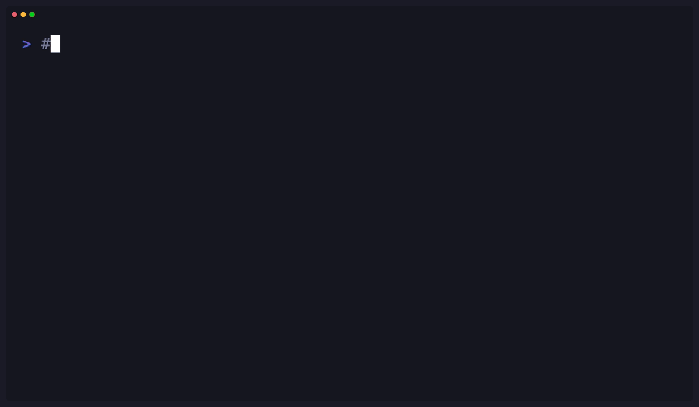

# tdx

[](https://github.com/niklas-heer/tdx/actions/workflows/ci.yml)
[](https://github.com/niklas-heer/tdx/actions/workflows/ci.yml)
[](https://github.com/niklas-heer/tdx/releases)
[](https://goreportcard.com/report/github.com/niklas-heer/tdx)

**Your todos, in markdown, done fast.**

<p align="center">
  
</p>

A fast, single-binary CLI todo manager focused on developer experience. Features vim-style navigation, an interactive TUI, and scriptable commands—all stored in plain markdown you can version control.

## Features

- ⚡ **Fast** - Single binary (4MB), instant startup, 30-40x faster than alternatives
- 📝 **Markdown-native** - Todos live in `todo.md`, version control friendly
- ⌨️ **Vim-style navigation** - `j/k`, relative jumps (`5j`), number keys
- 🖥️ **Interactive TUI** - Toggle, create, edit, delete, undo, move, copy
- 🎯 **Command Palette** - Helix-style `:` commands with fuzzy search
- 📋 **Read-Only Mode** - Prevent auto-save, check/uncheck all, filter done
- 🔧 **Scriptable** - `list`, `add`, `toggle`, `edit`, `delete` commands
- 🔄 **Smart Conflict Handling** - Atomic saves, external-change detection, visual conflict diffs
- 🕘 **Version History** - Automatic snapshots with visual diffs and safe restore
- 📑 **Per-File Configuration** - YAML frontmatter for file-specific settings
- 📂 **Recent Files** - Jump to recently opened files with cursor position restoration
- 🌍 **Cross-platform** - macOS, Linux, Windows

## Sections and projects

Press **s** to open the section overview. It lists every Markdown heading, including empty sections, with nested headings indented and completion counts beside each project.

| Key in the section overview | Action |
| --- | --- |
| ↑ / ↓ or j / k | Select a section |
| Enter | Focus the section and its subsections |
| Space | Fold or unfold its tasks |
| e | Rename the selected heading |
| n | Create a section after the selected section |
| N | Create a subsection (up to heading level 6) |
| a | Show all tasks and clear folds |
| Esc | Return to the task list |

While focused, **n** adds a task after the selection; in an empty section it creates that section's first task. **N** adds to the focused section's own task list. Press **S** to return to all sections. Tag, priority, due-date, completed-task filters, and search respect the current section. Focus and folds last for the current session and reset when a file is reloaded, headings change, or an edit is undone. **u** undoes up to 100 edits during the session.

Section editing uses the same guarded saves and version history as task editing. Read-only files support section browsing and focus without permitting heading edits.

### What's new in 0.14 (unreleased)

- Manage projects directly through Markdown headings, without opening another editor.
- Compose tdx with scripts and editors using filtered JSON output and explicit file selection.
- Type and paste international text in task, search, command, and recent-file inputs.
- Use the current Bubble Tea and Lip Gloss v2 terminal renderer and input handling.
- Use mise for reproducible development tools and tasks. `mise tasks` lists available commands; `mise run check` runs local validation.
- Installation defaults to `~/.local/bin`; set `TDX_INSTALL_DIR` to choose another directory. Existing todo files and global configuration remain compatible.

## Scripting and editor integrations

Query a project without opening the TUI or writing history:

```bash
tdx --file ./TASKS list --json --status open --tag backend
tdx tasks.md list --status done
tdx tasks.md list --json | jq -r '.[] | select(.priority == 1) | .text'
tdx add -- --read-only          # Add literal flag-like text
tdx --read-only tasks.md list   # Reads work; CLI writes are rejected
```

`--file` (or `-f`) accepts any filename, including paths with spaces or without a `.md` extension. The positional `tdx tasks.md …` syntax still works. Options may appear before or after the command; use `--` before task text that starts with a dash. Shell quoting is preserved as received, including intentional quote characters in task text.

`list` supports `--status all|open|done` (default `all`) and exact, case-sensitive `--tag` filters, with or without the leading `#`. Repeat `--tag` to require every tag. Filters apply to both text and JSON output. An empty JSON result is `[]`, including when the todo file does not exist; listing does not create that file or require a writable history directory.

Each JSON task contains:

| Field | Meaning |
| --- | --- |
| `index` | One-based position in the full file, preserved when filtering |
| `text`, `checked` | Markdown task text and completion state |
| `depth`, `parent_index` | Nesting depth and one-based parent position; `null` for root tasks |
| `tags`, `priority` | Tag array (empty is `[]`); priority `0` means unset |
| `due_date` | `YYYY-MM-DD` or `null` |

Indexes are positions, **not persistent IDs**: re-query after inserting, deleting, reordering, or externally editing tasks before using an index in a write command. JSON goes only to stdout; errors go to stderr with exit code 1. Successful commands exit 0. The schema remains subject to change during pre-1.0 development.

## Installation

### Homebrew (macOS/Linux)

```bash
brew install niklas-heer/tap/tdx
```

### Quick Install Script

```bash
curl -fsSL https://niklas-heer.github.io/tdx/install.sh | bash
```

### Download Binary

Download the latest binary for your platform from [Releases](https://github.com/niklas-heer/tdx/releases):

- `tdx-darwin-arm64` - macOS Apple Silicon
- `tdx-darwin-amd64` - macOS Intel
- `tdx-linux-amd64` - Linux x64
- `tdx-linux-arm64` - Linux ARM64
- `tdx-windows-amd64.exe` - Windows x64

### From Source

Requires [mise](https://mise.jdx.dev), which installs the pinned Go toolchain:

```bash
git clone https://github.com/niklas-heer/tdx.git
cd tdx
mise trust
mise install
mise run build
mise run install
```

### Nix

```bash
# Try it without installing
nix run github:niklas-heer/tdx

# Install to profile
nix profile install github:niklas-heer/tdx
```

## Usage

### Interactive TUI (Default)

Launch the interactive todo manager:

```bash
tdx
```

**Keyboard Shortcuts:**

| Key | Action |
|-----|--------|
| `j` / `k` | Move down / up |
| `gg` | Go to first item |
| `G` | Go to last item |
| `Space` / `Enter` | Toggle completion |
| `n` | New todo after cursor |
| `N` | New todo at end of file |
| `e` | Edit todo |
| `d` | Delete todo |
| `c` | Copy to clipboard |
| `m` | Move mode |
| `Tab` | Indent (nest under previous) |
| `Shift+Tab` | Outdent (move up one level) |
| `/` | Fuzzy search |
| `t` | Tag filter |
| `p` | Priority filter |
| `D` | Due date filter |
| `r` | Recent files |
| `:` | Command palette |
| `u` | Undo |
| `?` | Help menu |
| `Esc` | Quit |
| `Cmd+V` / `Ctrl+Y` | Paste (in edit mode) |

**Command Palette (`:`):**

Press `:` to open the command palette with fuzzy search. Available commands:

| Command | Description |
|---------|-------------|
| `check-all` | Mark all todos as complete |
| `uncheck-all` | Mark all todos as incomplete |
| `sort-done` | Sort todos by completion (incomplete first) |
| `sort-priority` | Sort todos by priority (p1 first, then p2, etc.) |
| `sort-due` | Sort todos by due date (earliest first) |
| `filter-done` | Toggle showing/hiding completed todos |
| `filter-due` | Toggle showing only todos with due dates |
| `filter-overdue` | Toggle showing only overdue todos |
| `filter-today` | Toggle showing only todos due today |
| `filter-week` | Toggle showing only todos due this week |
| `clear-done` | Delete all completed todos |
| `read-only` | Toggle read-only mode (changes not saved) |
| `save` | Save current state to file |
| `force-save` | Force save even if file was modified externally |
| `reload` | Reload file from disk (discards unsaved changes) |
| `versions` | Browse, compare, and restore file version history |
| `wrap` | Toggle word wrap for long lines |
| `line-numbers` | Toggle relative line numbers |
| `set-max-visible` | Set max visible items for this session |
| `show-headings` | Toggle displaying markdown headings between tasks |

**Read-Only Mode:**

Start tdx with `-r` or `--read-only` flag for workflows where you don't want changes saved automatically:

```bash
tdx -r checklist.md
```

Use `:save` to manually save when ready, or `:read-only` to turn auto-save back on.

**Vim-style navigation:**
- `5j` - Move down 5 lines
- `3k` - Move up 3 lines
- `gg` - Jump to first item
- `G` - Jump to last item

**Fuzzy Search:**
Press `/` to enter search mode. Type to filter todos with live highlighting. Press `Enter` to select or `Esc` to cancel.

**Nested Tasks:**

Organize your todos hierarchically using `Tab` and `Shift+Tab`:

```markdown
- [ ] Main project
  - [ ] Subtask 1
  - [ ] Subtask 2
    - [ ] Sub-subtask
- [ ] Another task
```

- Press `Tab` to indent a task under its previous sibling
- Press `Shift+Tab` to outdent (move up one level)
- Deleting a parent task promotes its children to the parent's level
- New tasks (`n`) are created at the same nesting level as the cursor

**Tags & Filtering:**

Add hashtags to your todos for organization:

```markdown
- [ ] Fix authentication #urgent #backend
- [ ] Update docs #docs
- [ ] Add dark mode #feature #frontend
```

Press `t` to open tag filter mode:
- Navigate with `↑/↓` or `j/k`
- Toggle tags with `Space` or `Enter`
- Clear all filters with `c`
- Press `Esc` when done

Active tag filters are shown in the status bar. Todos are automatically filtered to show only matching items.

**Priorities:**

Add priority markers to your todos using `!p1`, `!p2`, `!p3`, etc.:

```markdown
- [ ] Fix critical security bug !p1
- [ ] Update dependencies !p2
- [ ] Write documentation !p3
- [ ] Refactor code !p2
- [ ] Add nice-to-have feature
```

Priority levels:
- `!p1` - Critical/Urgent (displayed in red)
- `!p2` - High priority (displayed in orange)
- `!p3` - Medium priority (displayed in yellow)
- `!p4+` - Lower priorities (displayed dimmed)

Use the `:sort-priority` command to sort todos by priority (p1 first, then p2, etc.). Tasks without a priority marker are placed at the end. You can combine priorities with tags: `Fix bug !p1 #backend #urgent`

**Priority Filtering:**

Press `p` to open priority filter mode:
- Navigate with `↑/↓` or `j/k`
- Toggle priorities with `Space` or `Enter`
- Clear all filters with `c`
- Press `Esc` when done

Active priority filters are shown in the status bar (e.g., `⚡ p1 p2`). You can combine priority and tag filters to narrow down your view.

**Due Dates:**

Add due dates to your todos using `@due(YYYY-MM-DD)`:

```markdown
- [ ] Submit quarterly report @due(2025-12-01)
- [ ] Review pull request @due(2025-11-30) #code-review
- [ ] Fix critical bug !p1 @due(2025-11-29) #urgent
- [ ] Plan team meeting @due(2025-12-15)
```

Due date display colors based on urgency:
- **Overdue** - Red (past the due date)
- **Due today** - Orange
- **Due soon** - Yellow (within 3 days)
- **Future** - Dimmed

Use the `:sort-due` command to sort todos by due date (earliest first). Tasks without a due date are placed at the end. You can combine due dates with priorities and tags.

**Due Date Filtering:**

Press `D` (capital D) to open due date filter mode:
- **Overdue** - Show only overdue tasks
- **Today** - Show tasks due today
- **This Week** - Show tasks due within 7 days
- **Has Due Date** - Show all tasks with any due date

Navigate with `↑/↓` or `j/k`, select with `Space` or `Enter`, clear with `c`, and press `Esc` when done.

Active due date filters are shown in the status bar (e.g., `📅 overdue`). You can combine due date filters with priority and tag filters.

### CLI Commands

```bash
# List all todos
tdx list

# Add a new todo
tdx add "Buy milk"

# Toggle completion (1-based index)
tdx toggle 1

# Edit a todo
tdx edit 2 "Updated text"

# Delete a todo
tdx delete 3

# Open most recent file
tdx last

# Use custom file
tdx ~/notes/work.md list
tdx project.md add "Task"
```

### Recent Files

tdx automatically tracks recently opened files and restores your cursor position when you reopen them.

**TUI Mode:**

Press `r` in the TUI to open the recent files overlay:
- Type to filter files by path (fuzzy search)
- Navigate with `↑/↓` or `j/k`
- Press `Enter` to open a file
- Press `Esc` or `r` to close

**CLI Commands:**

```bash
# Open the most recently used file
tdx last

# List recently opened files (sorted by frequency and recency)
tdx recent

# Open a specific recent file by number
tdx recent 1

# Clear recent files history
tdx recent clear
```

**Features:**
- **Smart Sorting**: Files are ranked by both frequency (how often you open them) and recency (when you last accessed them)
- **Cursor Restoration**: When you reopen a file, tdx automatically restores your cursor to the last position
- **Change Detection**: If the file content has changed since your last visit, the cursor resets to the first item for safety
- **Configurable Limit**: Set maximum recent files in your config (default: 20)

**Configuration:**

In `~/.config/tdx/config.toml`:

```toml
[recent]
max_files = 20  # Maximum number of recent files to track
```

Recent files are stored in `~/.config/tdx/recent.json` and include:
- File path
- Last access time
- Access count (frequency)
- Last cursor position
- Content hash (for change detection)

### Version History

tdx automatically stores content-addressed snapshots when a file is opened or successfully changed. Open the command palette and run `:versions` to compare the current file with earlier versions and restore one safely.

- Navigate versions with `↑`/`↓` or `j`/`k`
- Scroll the diff with `PgUp`/`PgDn`
- Press `Enter`, then `y`, to confirm a restore
- Press `Esc` to close without changing the file

By default, tdx retains the latest 100 versions per file. Configure the limit in `~/.config/tdx/config.toml`; set it to `0` for unlimited history:

```toml
[versioning]
max_versions = 100
```

## File Format

Todos are stored in `todo.md` using standard Markdown:

```markdown
# Todos

- [x] Completed task
- [ ] Incomplete task
- [ ] Another task
```

Other Markdown content is preserved, including bare URLs, email addresses,
links, inline HTML, emphasis, and code.

### Configuration

tdx supports three levels of configuration with the following priority:

**Priority Order:** CLI flags > Frontmatter > Global config > Defaults

#### Global Configuration

Create `~/.config/tdx/config.toml` (or `$XDG_CONFIG_HOME/tdx/config.toml`) to set defaults:

```toml
[theme]
name = "tokyo-night"

[display]
check_symbol = "✓"
select_marker = "➜"

[defaults]
file = "todo.md"      # default file (use ~/path for central file)
max_visible = 0       # 0 = unlimited
word_wrap = true
show_headings = false
read_only = false
filter_done = false

[recent]
max_files = 20

[versioning]
max_versions = 100  # 0 = unlimited
```

You only need to include the settings you want to change from the defaults.

**Available options:**

| Section | Option | Type | Default | Description |
|---------|--------|------|---------|-------------|
| `[theme]` | `name` | string | "tokyo-night" | Theme to use |
| `[display]` | `check_symbol` | string | "✓" | Symbol for completed items |
| `[display]` | `select_marker` | string | "➜" | Symbol for selected item |
| `[defaults]` | `file` | string | "todo.md" | Default file path (use `~/path` for central file) |
| `[defaults]` | `max_visible` | number | 0 | Limit visible tasks (0 = unlimited) |
| `[defaults]` | `word_wrap` | boolean | true | Enable word wrapping for long lines |
| `[defaults]` | `show_headings` | boolean | false | Show markdown headings between tasks |
| `[defaults]` | `read_only` | boolean | false | Prevent all edits (view-only mode) |
| `[defaults]` | `filter_done` | boolean | false | Hide completed tasks by default |
| `[recent]` | `max_files` | number | 20 | Maximum recent files to track |
| `[versioning]` | `max_versions` | number | 100 | Versions retained per file (0 = unlimited) |

#### Per-File Configuration

Add YAML frontmatter to customize behavior for specific files:

```markdown
---
read-only: false
max-visible: 10
show-headings: true
---
# Todos

- [ ] Task one
```

**Examples:**

Read-only checklist:
```markdown
---
read-only: true
---
# Shopping List
- [ ] Milk
```

Project tracker with headings:
```markdown
---
show-headings: true
max-visible: 15
filter-done: true
---
# Project Tasks

## Backend
- [ ] API endpoints

## Frontend
- [ ] UI components
```

#### Configuration Priority

Settings are applied in this order (highest to lowest priority):

1. **CLI flags** - `tdx -r --show-headings todo.md`
2. **Frontmatter** - YAML at top of individual todo files
3. **Global config** - `~/.config/tdx/config.toml`
4. **Defaults** - Built-in defaults (word_wrap: true, others: false/0)

**Example:**
```bash
# config.toml sets word_wrap = false
# Frontmatter sets read-only: true
# CLI flag: --show-headings
# Result: word_wrap=false, read_only=true, show_headings=true
tdx --show-headings todo.md
```

## Architecture

### AST-Based Markdown Engine

tdx uses **[Goldmark](https://github.com/yuin/goldmark)** (Go's industry-standard Markdown parser) with a custom serializer to provide robust, format-preserving todo management:

**Why AST over regex?**
- ⚡ **Performance** - Parse once, manipulate efficiently in memory
- 🎯 **Precision** - Surgical updates to specific nodes without side effects
- 📝 **Format Preservation** - Maintains your markdown structure, spacing, and formatting
- 🔒 **Reliability** - Correctly handles edge cases (nested lists, code blocks, links, etc.)
- 🏷️ **Rich Features** - Enables advanced features like tag extraction, heading tracking

**How it works:**

```
Read File → Goldmark Parser → AST (in-memory tree)
                                  ↓
                           Manipulate nodes
                           (toggle, add, delete, swap)
                                  ↓
                          Custom Serializer → Write File
```

**Implementation Details:**

1. **Parser** (`internal/markdown/ast.go:29`)
   - Uses **Goldmark** with tables, strikethrough, and task-list extensions
   - Keeps presentation-only linkification disabled so bare URLs remain exact source text
   - Parses markdown into an Abstract Syntax Tree
   - Each todo becomes a `TaskCheckBox` node within a `ListItem`
   - Preserves source bytes with segment pointers for text nodes

2. **AST Operations** (`internal/markdown/ast.go`)
   - `ExtractTodos()` - Walk AST and collect all task list items
   - `ExtractHeadings()` - Find headings and their positions relative to todos
   - `ToggleTodo()` - Flip checkbox state in the AST
   - `UpdateTodoText()` - Replace editable inline content while preserving list structure
   - `DeleteTodo()` - Remove list item node from parent
   - `AddTodo()` - Create new list item with checkbox and text nodes
   - `SwapTodos()` - Reorder list items (handles adjacent and cross-section swaps)

3. **Custom Serializer** (`internal/markdown/serializer.go:12`)
   - Recursively walks the modified AST
   - Reconstructs markdown with proper formatting
   - Built custom because Goldmark's renderer had formatting issues
   - Handles: headings, lists, checkboxes, code blocks, links, emphasis, strikethrough, etc.
   - Preserves spacing and blank lines

**Key Benefits:**

- ✅ **Non-destructive** - Your markdown formatting, comments, and structure stay intact
- ✅ **Complex markdown** - Handles nested lists, code blocks, links, emphasis seamlessly
- ✅ **Durable writes** - Atomic replace with flushes and conflict detection
- ✅ **Predictable** - AST guarantees correct parsing and serialization
- ✅ **Tag support** - HashtagExtraction built into AST traversal
- ✅ **Heading-aware** - Knows which todos belong under which headings

### Performance Optimizations

tdx is built for speed with several key optimizations:

- **Search debouncing** - Search operations are debounced (50ms) to avoid scoring all todos on every keystroke
- **Heading caching** - Heading positions are cached and only recomputed when todos change
- **Zero-allocation navigation** - Finding next/previous visible items allocates no memory (~8ns)
- **Unified input handling** - TUI and piped input share the same handlers, reducing code and bugs

**Benchmark results** (Apple M4):
```
FuzzyScore (exact match):     5.6ns/op    0 allocs
FuzzyScore (fuzzy match):    33.4ns/op    0 allocs
Cached headings:              1.0ns/op    0 allocs
Search 100 todos:             9.8µs/op  114 allocs
Navigation (visible todo):    8.0ns/op    0 allocs
```

### Project Structure

```
tdx/
├── .dagger/             # Portable CI and release pipeline (Go)
├── mise.toml          # Documented development tasks
├── cmd/tdx/              # Main application
│   ├── main.go          # Entry point, CLI routing
│   ├── config.go        # Build-time configuration
│   ├── userconfig.go    # User configuration (themes, settings)
│   └── *_test.go        # Comprehensive test suite
├── internal/
│   ├── markdown/        # AST-based markdown engine
│   │   ├── parser.go    # Markdown → AST
│   │   ├── ast.go       # AST data structures
│   │   └── serializer.go # AST → Markdown
│   ├── tui/             # Terminal UI (Bubble Tea)
│   │   ├── model.go     # Application state
│   │   ├── update.go    # Event handling
│   │   ├── view.go      # Rendering
│   │   ├── commands.go  # Command palette
│   │   ├── render.go    # Display logic
│   │   └── *_test.go    # Unit & benchmark tests
│   ├── editor/          # Shared editing actions and bounded undo
│   ├── cmd/             # CLI command handlers
│   │   └── cli.go       # List, add, toggle, etc.
│   ├── config/          # Configuration handling
│   │   ├── config.go    # Legacy YAML config (deprecated)
│   │   └── recent.go    # Recent files tracking
│   └── util/            # Utilities
│       ├── text.go      # Text processing, fuzzy search
│       ├── clipboard.go # Clipboard operations
│       └── text_test.go # Unit & benchmark tests
└── scripts/             # Development & release tools
```

## Development

### Prerequisites

- Go 1.27.1 (installed by mise)
- [mise](https://mise.jdx.dev) (tool versions and tasks)
- Bash (use Git Bash on Windows)

After cloning, run `mise trust` and `mise run setup`. Docker is required only for Dagger tasks (`ci` and `release-artifacts`); normal build, test, and lint tasks run locally.

- [Dagger 0.21.9](https://docs.dagger.io/install/) and a Docker-compatible container runtime for the portable CI pipeline

The CLI and TUI share document actions in `internal/editor`. Configuration, styles, recent files, and Markdown history callbacks belong to each application instance, making isolated integration tests straightforward.

For the optional Rust parser experiment, run `mise run rust:check` and `mise run rust-eval`. See the [measured comparison and limitations](experiments/rust-eval/README.md); Rust is not part of the shipped application.

### Building

```bash
# Build binary
mise run build

# Build for all platforms
mise run build-all

# Install to ~/.local/bin
mise run install
```

### Commands

```bash
mise run build        # Build binary
mise run build-all    # Build all release targets with Dagger
mise run install      # Install to ~/.local/bin
mise run tui          # Run TUI
mise run demo         # Try a disposable project with isolated config/history
mise run coverage     # Generate dist/coverage/index.html
mise run list         # List todos
mise run add "X"      # Add todo
mise run toggle 1     # Toggle todo
mise run check        # Run local quality checks
mise run fmt          # Format code
mise run ci           # Run the same portable checks used by GitHub CI
mise run ci-lint      # Run the pinned linter through Dagger
mise run ci-test      # Run race-enabled tests through Dagger
mise run ci-workflows # Validate GitHub workflow syntax locally
mise run clean        # Clean artifacts
```

For a fast feedback loop, pass Go test arguments directly:

```bash
mise run test -- ./internal/cmd -run TestList -count=1
mise run test:race -- ./internal/markdown
mise run coverage
```

Without arguments, both test tasks run every application package. `mise run demo` opens a temporary copy of `examples/project-tracker.md`, with its own configuration and history. Edits disappear on exit; personal settings and the source example are untouched. The command tests likewise use temporary configuration, and their subprocess binary/config directories are cleaned up after the suite finishes.

The Dagger pipeline is pinned in `dagger.json` and implements CI in Go. GitHub still runs native macOS and Windows filesystem tests because those platform semantics cannot be reproduced by Linux containers.

## Theme Customization

### Theme Picker

Press `:` to open the command palette and select `theme` to open the theme picker:
- Navigate with `↑/↓` or `j/k` to preview themes in real-time
- Press `Enter` to apply and save the theme
- Press `Esc` to cancel and restore the previous theme

The selected theme is automatically saved to your config file.

### Theme Config File

Set your theme in `~/.config/tdx/config.toml`:

```toml
[theme]
name = "tokyo-night"  # or any builtin/custom theme
```

See the [Global Configuration](#global-configuration) section for all available settings.

### Builtin Themes

- `tokyo-night` (default)
- `catppuccin-latte` (light)
- `catppuccin-frappe`
- `catppuccin-macchiato`
- `catppuccin-mocha`
- `dracula`
- `github-dark`
- `gruvbox-dark`
- `monokai`
- `nord`
- `one-dark`
- `rose-pine`
- `solarized-dark`

### Custom Themes

Create your own themes by adding `.toml` files to `~/.config/tdx/themes/`:

```toml
# ~/.config/tdx/themes/my-theme.toml
[theme]
name = "my-theme"
author = "Your Name"

[colors]
# Core colors
Base = "#c0caf5"       # default foreground
Dim = "#565f89"        # muted text
Accent = "#7aa2f7"     # highlights, selections
Success = "#9ece6a"    # completed items, matches
Warning = "#e0af68"    # move mode
Important = "#bb9af7"  # checked items
AlertError = "#f7768e" # errors

# Tags (hashtags like #urgent)
Tag = "#e0af68"

# Priorities (!p1, !p2, !p3+)
PriorityHigh = "#f7768e"    # !p1 - critical
PriorityMedium = "#bb9af7"  # !p2 - high
PriorityLow = "#565f89"     # !p3+ - medium/low

# Due dates (@due(YYYY-MM-DD))
DueUrgent = "#7dcfff"  # overdue or due today
DueSoon = "#7aa2f7"    # due within 3 days
DueFuture = "#565f89"  # due later
```

Custom themes appear in the theme picker alongside builtin themes. You can also override builtin themes by creating a file with the same theme name.

**Note:** The Tag, Priority*, and Due* colors are optional. If omitted, sensible defaults are used based on the core colors.

### Custom File Path

```bash
tdx ~/notes/work.md           # Use specific file
tdx project.md add "Task"     # All commands work
```

### Build Configuration

Build metadata in `tdx.toml`:
```toml
version = "0.6.0"
description = "your todos, in markdown, done fast"
```

## License

MIT - see [LICENSE](LICENSE)

The application and build containers use Go 1.27.1. Dagger's SDK module targets Go 1.26.7, the newest toolchain supported by Dagger 0.21.9's generator. Its OpenTelemetry logging packages retain compatibility pins because the current Dagger adapter does not support the newer logging API.
